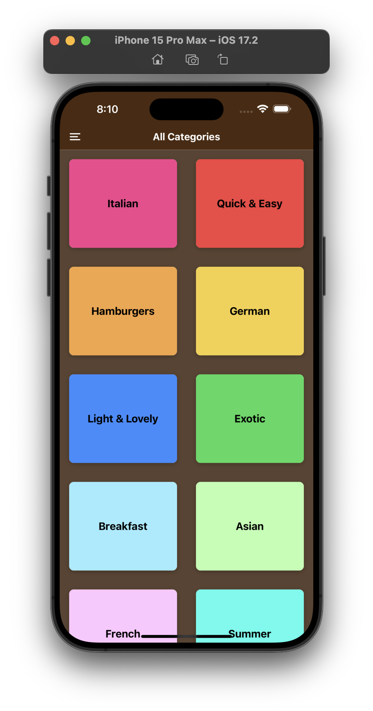
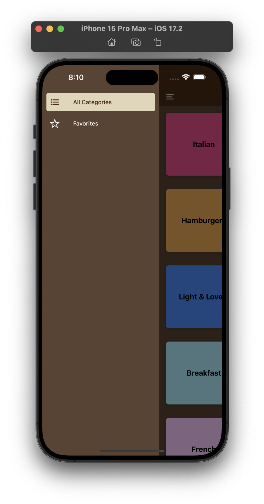
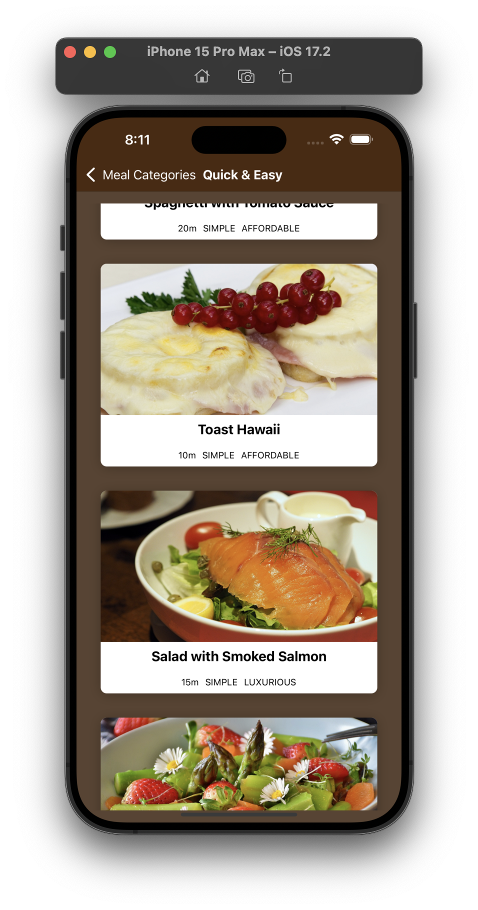
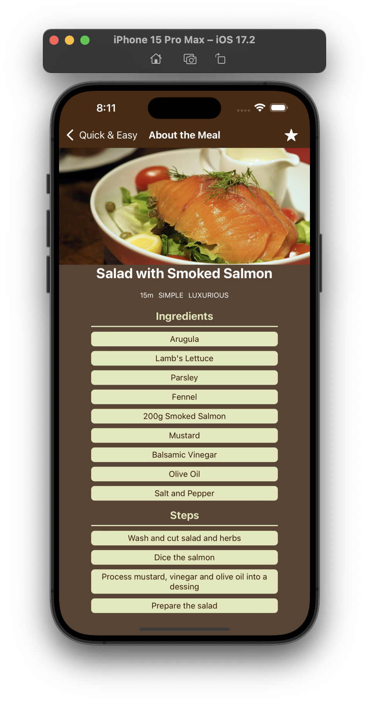
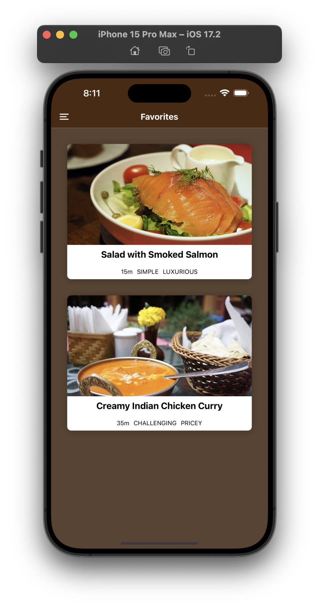

# React Native Meals App

Welcome to the React Native Meals App, a delightful mobile application designed to help users explore various meals, view details, and manage their favorite meals list. The app utilizes React Native and Redux for state management.

## Features

### Meals Category

- **Browse Categories:** Explore a variety of meal categories.
- **Category Details:** View meals within a specific category.

### Meals Overview

- **Meal List:** Browse through a list of meals with images and basic information.
- **Add to Favorites:** Add meals to your favorites list.

### Meals Details

- **Detailed Information:** Access detailed information about a specific meal, including ingredients and instructions.
- **Add to Favorites:** Add or remove meals from your favorites list.

### Favorites List (Redux Store)

- **Manage Favorites:** Easily manage your list of favorite meals.
- **Persistent Storage:** Favorites are stored using Redux, ensuring persistence across app sessions.

## Screenshots

Include a few screenshots or GIFs demonstrating the app's user interface and key features.







## Acknowledgements

- [ReactJS](https://react.dev)
- [React Native](https://reactnative.dev/)
- [Redux](https://redux.js.org/)
- [Expo](https://expo.dev/)

## How to Start the Project

Follow these steps to run the **React Native Meals App** on your local machine:

**Note**: Make sure Android studio install in your local machine then using android emulator run app on your emulator.

1. **Clone the Repository**:
   Clone this repository to your local machine using the following command:

   ```bash
   git clone https://github.com/kabhinav577/react-native-meals-app.git
   ```

2. Navigate to the Project Directory:

   ```
   cd react-native-meals-app

   ```

3. Install Dependencies:

   ```
   npm install

   ```

4. Start the Development Server:

   ```
   npm start

   ```

5. Access the App:

   Download Expo go from play store and Scan **Expo Qr Code** in Expo go app.

## Authors

- [@krishna Kant singh](https://krishnakant-singh.vercel.app/)
